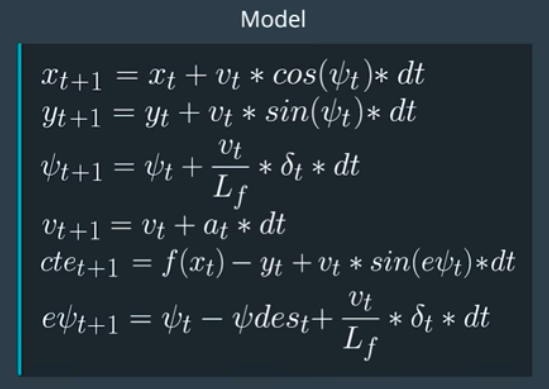
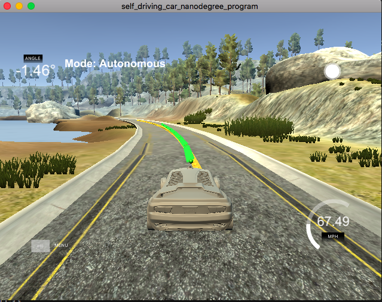

# CarND-Controls-MPC
Self-Driving Car Engineer Nanodegree Program

---

## Dependencies

* cmake >= 3.5
 * All OSes: [click here for installation instructions](https://cmake.org/install/)
* make >= 4.1(mac, linux), 3.81(Windows)
  * Linux: make is installed by default on most Linux distros
  * Mac: [install Xcode command line tools to get make](https://developer.apple.com/xcode/features/)
  * Windows: [Click here for installation instructions](http://gnuwin32.sourceforge.net/packages/make.htm)
* gcc/g++ >= 5.4
  * Linux: gcc / g++ is installed by default on most Linux distros
  * Mac: same deal as make - [install Xcode command line tools]((https://developer.apple.com/xcode/features/)
  * Windows: recommend using [MinGW](http://www.mingw.org/)
* [uWebSockets](https://github.com/uWebSockets/uWebSockets)
  * Run either `install-mac.sh` or `install-ubuntu.sh`.
  * If you install from source, checkout to commit `e94b6e1`, i.e.
    ```
    git clone https://github.com/uWebSockets/uWebSockets
    cd uWebSockets
    git checkout e94b6e1
    ```
    Some function signatures have changed in v0.14.x. See [this PR](https://github.com/udacity/CarND-MPC-Project/pull/3) for more details.

* **Ipopt and CppAD:** Please refer to [this document](https://github.com/udacity/CarND-MPC-Project/blob/master/install_Ipopt_CppAD.md) for installation instructions.
* [Eigen](http://eigen.tuxfamily.org/index.php?title=Main_Page). This is already part of the repo so you shouldn't have to worry about it.
* Simulator. You can download these from the [releases tab](https://github.com/udacity/self-driving-car-sim/releases).
* Not a dependency but read the [DATA.md](./DATA.md) for a description of the data sent back from the simulator.


## Basic Build Instructions

1. Clone this repo.
2. Make a build directory: `mkdir build && cd build`
3. Compile: `cmake .. && make`
4. Run it: `./mpc`.

---

## [Rubric](https://classroom.udacity.com/nanodegrees/nd013/parts/40f38239-66b6-46ec-ae68-03afd8a601c8/modules/f1820894-8322-4bb3-81aa-b26b3c6dcbaf/lessons/b1ff3be0-c904-438e-aad3-2b5379f0e0c3/concepts/1a2255a0-e23c-44cf-8d41-39b8a3c8264a) Points

### Compilation

1. Your code should compile.

   Code compiles on MacOS and other supported OS without any issues with mentioned command sequences.

### Implementation

1. The Model

   The Model used in this project is Kinematic Bicycle Model. It ignores dynamic effects such as inertia, friction and torque. This model is non-linear model as it takes changes of direction of drive. Model includes vehicle's position (`x, y`), orientation angle (`psi`), velocity (`v`), cross-track error (`cte`) and psi error (`epsi`), which can be representaed as equations as given below:

   

   As per the equations above I have computed predicted positions (`x, y`), orientation angle (`psi`), velocity (`v`), cross track error (`cte`) and psi error (epsi) for `t + 1` timestamp.

2. Timestep Length and Elapsed Duration (N & dt)

   The values chosen for N and dt are:

   ```
   N = 10
   dt = 0.1
   ```

   As per the trial and error I found that with Smaller value of N, car speed is not compromised. For example, if we were to set N to 100, the simulation would run much slower. This is because the solver would have to optimize 4 times as many control inputs.

   I have choosen values for `N` and `dt` based on multiple trial and error attemps. Based on that I found best results achived with `N=10` and `dt=0.1`, giving time horizon of `1 sec`. Values of `dt` smaller than `0.1` did not work, for instance `N=20` and `dt=0.05` resulted in crash of vehicle in the river.

   Implementation at `MPC.cpp` line 9-10

3. Polynomial Fitting and MPC Preprocessing

   Computations performed in vehicle coorinate system and cooridinates of the waypoints in vehicle coordinates are obtained by following equations:
   ```
   X = dX * cos(-psi) - dY * sin (-psi)
   Y = dX * sin(-psi) + dY * con (-psi)
   ```
   where, `dX = (psix[i] - x)`, `dY = (psiy[i] - y)` and `(X, Y)` = coordinates in Vehicle Coordinate System.

   Note that initial position of the car and heading direction are always assumed to be Zero in this frame, thus state of the Car in Vehicle Coordinate system can be represented as:

   ```
   auto coeffs = polyfit(ptsx_transformed, ptsy_transformed, 3);
   const double cte = polyeval(coeffs, 0);
   const double epsi = psi - atan(coeffs[1]);

   Eigen::VectorXd state(6);
   state << 0, 0, 0, v, cte, epsi;
   ```

   Although in order to take system latency into considerations, I had to compute state values with kinetic model equations. With updated value, I have initialized state.

   ```
   double latency = 100;
   double latency_dt = 1.0 / latency;
   double x1 = v * cos(0) * latency_dt;
   double y1 = v * sin(0) * latency_dt;
   double psi1 = - (v / mpc.Lf) * delta * latency_dt;
   double v1 = v + (a * latency_dt);
   double cte1 = cte + (v * sin(epsi) * latency_dt);
   double epsi1 = epsi - ((v / mpc.Lf) * delta *  latency_dt);

   Eigen::VectorXd state(6);
   state << x1, y1, psi1, v1, cte1, epsi1;
   ```

   This is implmented in `main.cpp` line 126-135.

4. Model Predictive Control with Latency

   The student implements Model Predictive Control that handles a 100 millisecond latency. Student provides details on how they deal with latency.

   I have choosen values for `N` and `dt` as `10` and `0.1`, respectively. Based on that I observed that `dt` should be in sync with system latency, which is `100ms`. Also with experiments, I get to know that time horizon `> 1 sec` did not improve the results and sometimes crashes the car.

   Implementation at `main.cpp` line 134-141.


### Simulation

1. The vehicle must successfully drive a lap around the track.

   No tire was going out of the track for entire route.

   
